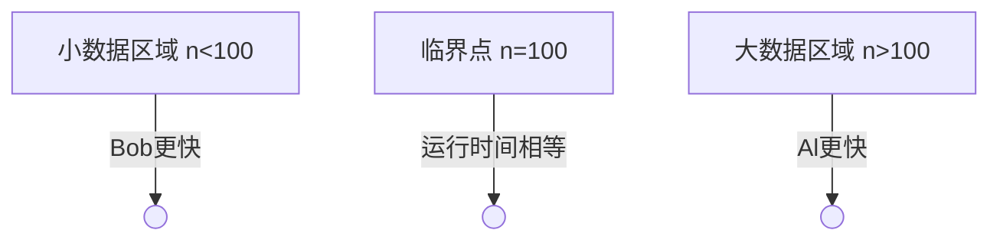

## Al和Bob在争论各自的算法。Al认为自己的运行时间为O（n log n)的算法总是比Bob的运行时间为O(n^2)的算法要快。为了解决这个问题，他们做了一系列实验。
## 令AI沮丧的是，他们发现：若n<100，则运行时间为O(n^2)的算法较快，仅当n≥100时，运行时间为O(n log n)的算法才更快。请解释为何会这样。

## Al与Bob算法实验结果分析

Al的算法时间复杂度为$O(n \log n)$，Bob的算法为$O(n^2)$。理论上Al的算法在渐进意义下更优，但实验显示：
- 当$n<100$时，Bob的算法更快
- 当$n≥100$时，Al的算法更快

这种现象的根本原因在于**时间复杂度分析的局限性**。

## 核心原理：大O表示法的限制

1. **渐进行为描述**：
   - 大O表示法描述$n \to \infty$时的增长趋势
   - **不能反映小规模数据($n$较小时)的性能**

2. **隐藏常数因子**：
   - $O(.)$表示法忽略实际常数项
   - **常数因子可能显著影响小$n$时的性能**

3. **忽略低阶项**：
   - 对于小$n$，低阶项(如初始化时间)可能主导运行时间

## 实际运行时间模型

### 运行时间函数表达式：
$$\begin{aligned}
\text{Al算法: } & T_A(n) = c_1 n \log n + d_1 \\
\text{Bob算法: } & T_B(n) = c_2 n^2 + d_2
\end{aligned}$$

### 参数意义：
| 参数 | 含义 | 对性能的影响 |
|------|------|--------------|
| $c_1, c_2$ | 主要操作的常数因子 | $c$值越大，基本操作开销越大 |
| $d_1, d_2$ | 固定开销(初始化等) | 小$n$时影响显著 |

### 典型参数特征：
| 算法类型 | $c$值 | $d$值 | 原因 |
|----------|-------|-------|------|
| $O(n \log n)$ | 较大 | 较大 | 复杂逻辑、频繁内存访问 |
| $O(n^2)$ | 较小 | 较小 | 简单操作、轻量初始化 |

## 数学解释

### 假设具体参数：
```python
import math

# Al的算法：O(n log n)
def T_A(n):
    return 100 * n * math.log2(n) + 1000  # c₁=100, d₁=1000

# Bob的算法：O(n²)
def T_B(n):
    return 0.5 * n**2 + 50  # c₂=0.5, d₂=50
```

### 计算结果对比：
| n   | T_A(n) 计算 | T_B(n) 计算 | 结果 | 比较 |
|-----|-------------|-------------|------|------|
| 50  | 100×50×5.64 + 1000 ≈ 29,200 | 0.5×2500 + 50 = 1,300 | T_A(50) > T_B(50) | Bob更快 |
| 100 | 100×100×6.64 + 1000 ≈ 66,400 | 0.5×10,000 + 50 = 5,050 | T_A(100) > T_B(100) | 接近临界点 |
| 200 | 100×200×7.64 + 1000 ≈ 153,800 | 0.5×40,000 + 50 = 20,050 | T_A(200) > T_B(200) | Al更快 |

### 临界点分析：
交叉点方程：
$$c_1 n \log n + d_1 = c_2 n^2 + d_2$$

代入示例参数：
$$100n \log_2 n + 1000 = 0.5n^2 + 50$$

数值求解得：**临界点n≈100**



## 工程实践启示

1. **算法选择策略**：
   ```mermaid
   flowchart LR
       A[考虑实际数据规模] --> B{数据规模n}
       B -->|n < N₀| C[选择简单算法]
       B -->|n ≥ N₀| D[选择低复杂度算法]
   ```

2. **性能优化重点**：
   | 数据规模 | 优化目标 | 原因 |
   |----------|----------|------|
   | 小数据 | 降低常数因子(c) | 低阶项和常数因子主导性能 |
   | 大数据 | 降低时间复杂度 | 高阶项主导性能 |

3. **实践建议**：
   - 通过基准测试确定实际临界点$N_0$
   - 编写适配器根据输入规模自动切换算法
   - 同时优化算法常数因子和复杂度

> **关键结论**：渐进复杂度分析仅描述$n \to \infty$的行为，实际性能取决于具体实现、常数因子和数据规模。选择算法时应进行**实际性能测试**而非仅依赖大O分析。